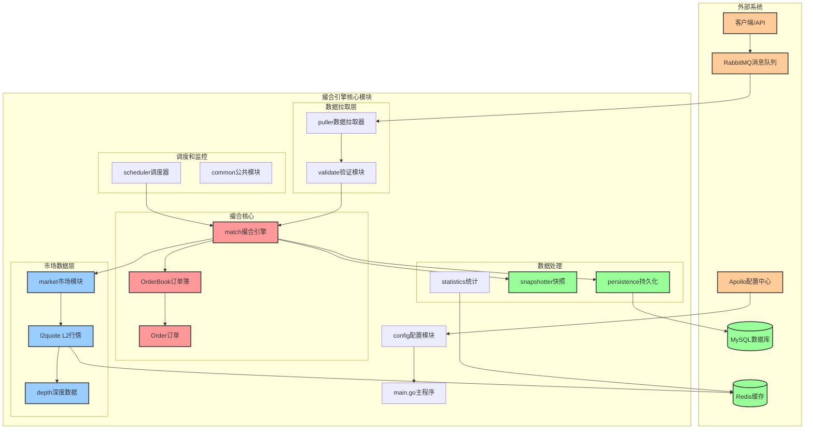
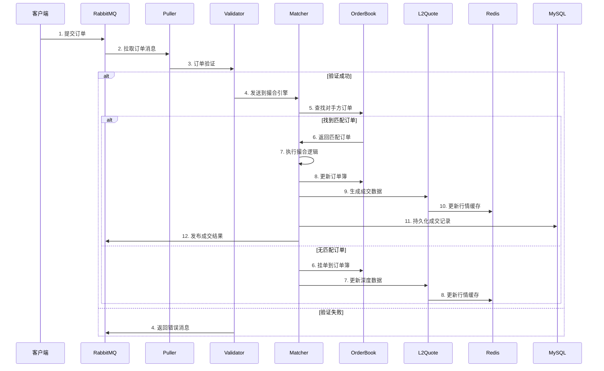
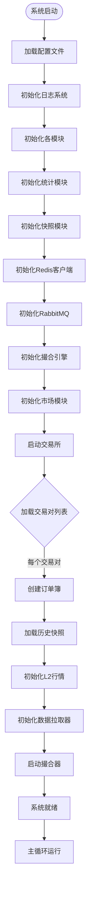
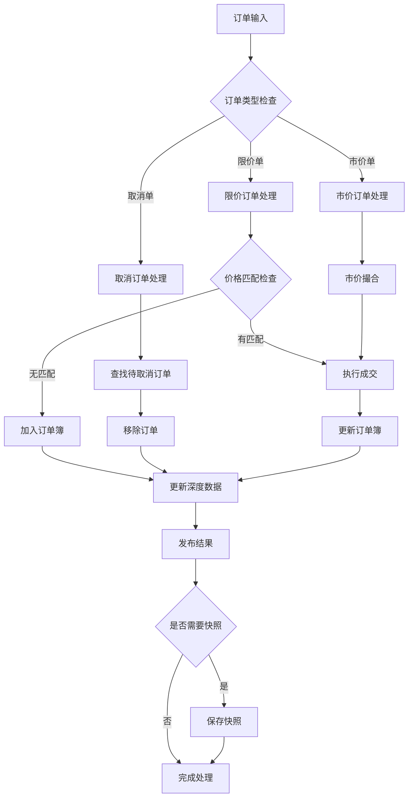
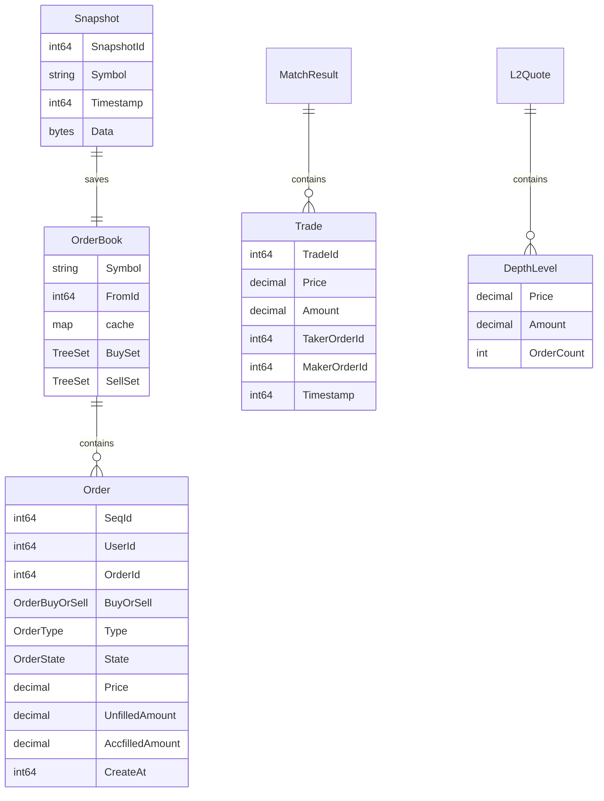

# 撮合引擎架构图和业务流程

## 系统架构图

## 业务流程图

### 订单撮合主流程

### 系统启动流程

### 撮合引擎内部流程

## 数据结构关系图

## 关键组件说明

### 1. 撮合引擎核心 (match包)
- **OrderBook**: 订单簿，使用红黑树存储买卖订单
- **Order**: 订单结构，包含价格、数量、类型等信息
- **Matcher**: 撮合逻辑，处理订单匹配和成交

### 2. 市场数据 (market包)
- **L2Quote**: L2级别行情数据生成
- **Depth**: 市场深度数据管理
- **Kline**: K线数据生成和管理

### 3. 数据处理
- **Puller**: 从消息队列拉取订单数据
- **Persistence**: 数据持久化到数据库
- **Snapshotter**: 订单簿快照管理

### 4. 基础设施
- **Redis**: 缓存行情数据和统计信息
- **RabbitMQ**: 订单消息队列和结果发布
- **MySQL**: 持久化存储成交记录

### 5. 监控和调度
- **Statistics**: 系统统计信息
- **Scheduler**: 定时任务调度
- **Validate**: 订单验证 